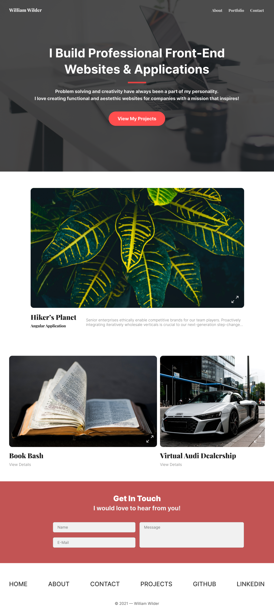
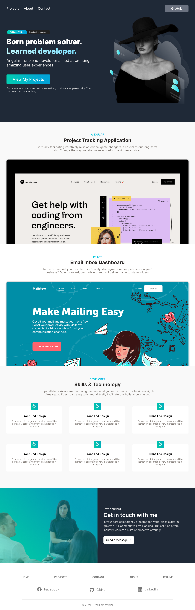

# Classes 32-35 - Personal Portfolio

## STEP 1: UNDERSTANDING THE ROLE OF A DEVELOPER PORTFOLIO

Having a personal portfolio has a multitude of benefits. It is a place to:

- Host your project & see your progression
- Showcase your skills and personality to potential employers
- Practice debriefing your applications by writing what you have learned
- Plan how you talk to future employers about your projects
- Demonstrate your commitment to learning
- Explore your personal brand or position as a developer
- Experiment with new technologies and stay up to date with tech trends

For our purposes, there are two most important things we want to focus on are creating a portfolio website. First, we want a place that showcases our projects for family and friends to see. The second is creating an online presence where employers can see your (fantastic) work and learn about you and your relationship with software development.

## STEP 2: GAINING INSPIRATION FOR A PORTFOLIO WEBSITE

Be inspired by, but do not steal:

- **[Awwwards](https://www.awwwards.com/)**: The awards of design, creativity, and innovation on the internet.

- **[Dribbble](https://dribbble.com/shots/popular/web-design)**: Community where designers gain inspiration, community, and jobs and are your best resource to discover and connect with designers worldwide.

- **[Panda](https://usepanda.com/)**: The homepage for your favorite websites.

- **[Codepen](https://codepen.io/)**: The best place to build, test, and discover front-end code.

- **[Godly](https://godly.website/)**: Astronomically good web design inspiration every single day.

- **[Behance](https://www.behance.net/)**: Leading online platform to showcase & discover creative work.

## STEP 3: PLANNING & DESIGNING YOUR WEBSITE

I have created two design templates. If you want to create your own, I suggest using Figma as a design tool or finding a template online you can base it on.

### Design Template #1 - Simple & Clean

### Design Template #2 - Classy & Cool

## STEP 4: CODING YOUR PORTFOLIO WEBSITE

Before beginning your project, you should go over with yourself the [project planning steps](../C31__Project-Management-&-Planning_Dev/C31_NOTES.md#application-planning-notes).

Decide on and clearly state:

- What technologies you are going to use
- The fundamental features you will implement
- Your intended audience and what they want to see (from project to sections on your page)
- How you will describe and write about your project on your website

## STEP 5: DEPLOYING YOUR WEBSITE & LINKING TO SOCIAL CHANNELS

- Use Netlify or a similar service to deploy your website
- Link to it on GitHub in your profile
- Host it on GitHub and create a Quick Link to it
- Post on LinkedIn and other Social Media channels

---

---

## RESOURCES

[Evergreen Developer Skills _(Repository)_ ](https://github.com/romenrg/evergreen-skills-developers)

[Curated list of topics that university covers in computer science _(Twitter Thread)_](https://twitter.com/haezurath/status/1505563416370597893?s=12)

[List of resumes](https://github.com/emmabostian/developer-portfolios)

[Prep for the interview](https://www.techinterviewhandbook.org/behavioral-interview/)
